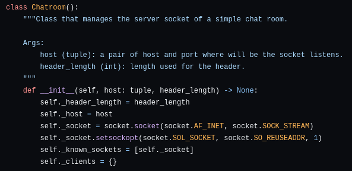
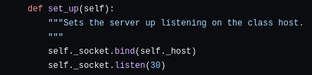
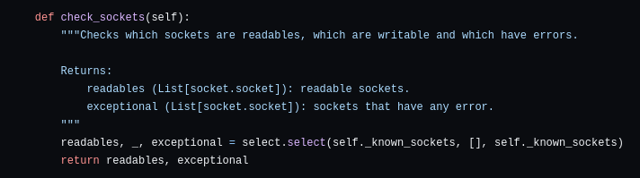
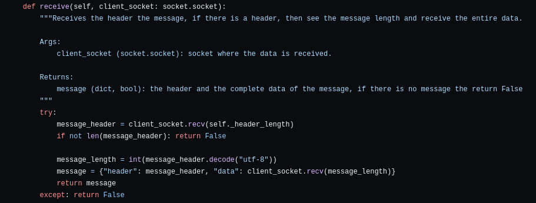
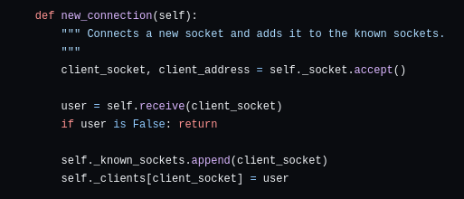
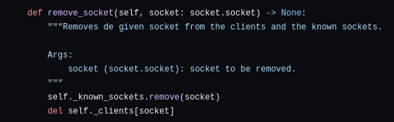
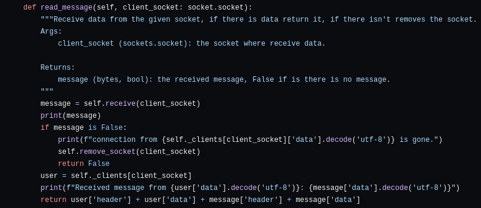
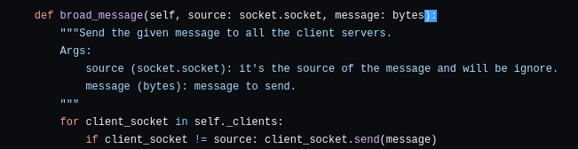
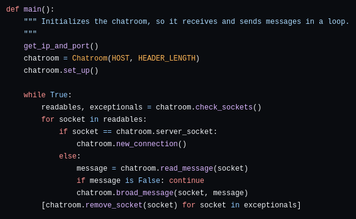

# Cómo se hizo

## Server

### Base del servidor
Para Manejar el *servidor* se creó una clase llamada **Chatroom**,
Los atributos de esta clase definen el tamaño del header, el host, el socket que actuará como *server* y también sus opciones; y una lista con los socket conocidos.

En este caso se especifica un tamaño para el header predefinido, y se crea el socket con las opciones de `AF_INET` para que trabaje con IPv4 y `SOCK_STREAM` para que utilice el protocolo de tipo TCP (Si se quisiera que trabaje con el protocolo UDP se utilizaría `SOCK_DGRAM`). Luego, se definen otras opciones para el socket usando `SOL_SOCKET` para definir la capa del socket la cual se va a configurar y `SO_REUSEADDR` es la opción usada para dejar que el socket reuse direcciones.

Se define un método el cual alza el servidor, y lo pone a escuchar en la dirección guardada en `self._host`.

Chequea la lista de sockets conocidos y revisa si se pueden leer, o si tienen errores

### Recibir información
El método para recibir mensajes recibe el socket de un cliente como parámetro, intenta recibir del cliente el header, y si este está vacío o hay algún error retorna falso, sino decodifica el header y recibe la cantidad de datos que este especifica.

El formato del mensaje que recibe el servidor es el siguiente
~~~ python
"<header>  <Mensaje>"
# Donde el header es el tamaño del mensaje y está formateado a ocupar 10 dígitos.
~~~

### Una nueva Conexión

El servidor acepta al socket que haya mandado la solicitud de conectarse y recibe el usuario, si este no tiene un usuario Ignora la conexión, sino lo agrega a la lista de sockets conocidos y al diccionario de clientes.

### Remover un Cliente
Es solo eliminarlo de la lista de sockets conocidos y removerlo del diccionario de clientes.

### Recibiendo mensajes
Para Recibir un mensaje, se intenta recibir la información, si no hay información, entonces se elimina el socket de la lista de clientes y ya, si se recibe alguna información entonces se junta la información de quién lo envió con el mensaje que envió y se retorna eso (Después se usará para enviarlo a los clientes).

### Esparciendo mensajes
Para que a todos los clientes se les envíe la información se recorre la lista de clientes y se verifica que no sean el socket de origen, y se usa el comando del socket para enviar la información.

### Todo Junto, En un Bucle

Para que todo esto funcione se instancia un objeto de la Clase `Chatroom` especificándole el tamaño del header, la dirección IP y el puerto en donde escuchará, se pone a escuchar y en un bucle se van chequeando qué sockets están bien y cuales están mal con `chatroom.check_sockets()`, los que están mal se eliminan de los sockets conocidos y de los clientes, a los que si están bien, incluyendo el servidor, se los itera. Cada vez que se tenga el socket del servidor se aceptarán nuevas opciones con `chatrrom.newconnection`. A los clientes se leen los mensajes que hayan enviados y luego se esparce esa información al resto de clientes con el método `chatroom.broad_message`.

## Cliente
